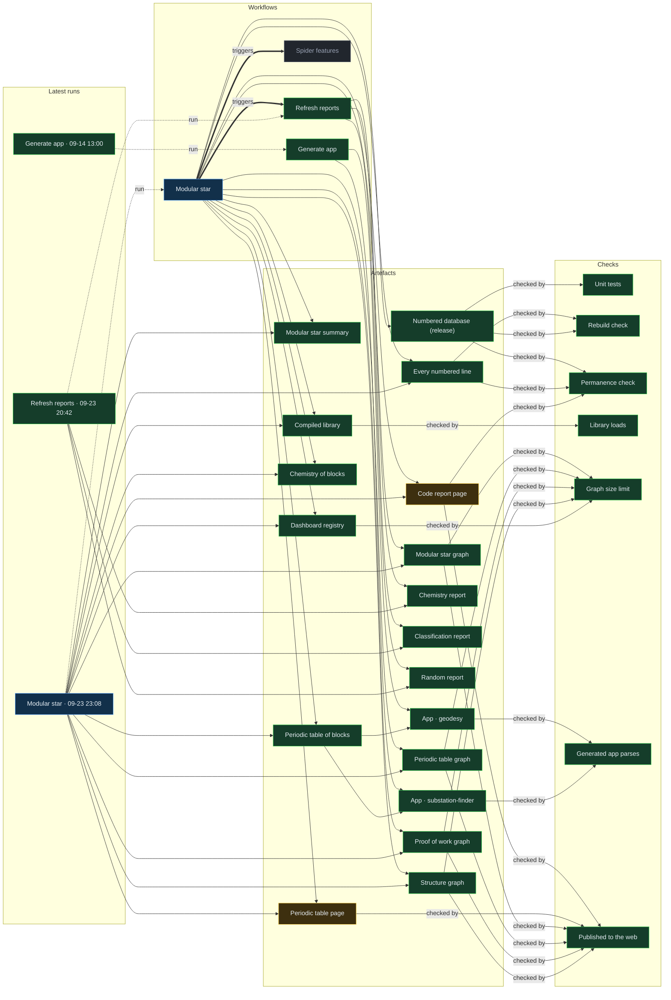

# Proof of work

Updated 2026-09-23 23:09 UTC by GitHub Actions. Green passed, amber needs a look, red failed, blue still running, grey not readable from here.
The same graph, card by card, is `proof/graph.json` (26 KB, 40 cards, 68 links), registered for the Spider dashboard as **Proof of work**.

| Workflow | Latest run | Started | Took | Last 10 |
|---|---|---|---|---|
| Modular star | [running now (this run writes this graph)](https://github.com/Ventusltd/stars/actions/runs/35932065351) | 2026-09-23 23:08 UTC |  | 6 of the last 7 runs passed |
| Refresh reports | [passed](https://github.com/Ventusltd/stars/actions/runs/35917712198) | 2026-09-23 20:42 UTC | 24 s | 10 of the last 10 runs passed |
| Generate app | [passed](https://github.com/Ventusltd/code-generator/actions/runs/34846587798) | 2026-09-14 13:00 UTC | 37 s | 5 of the last 7 runs passed |
| Spider features | not installed |  |  |  |

## Checks

- **Unit tests** (green): The numbering and parsing logic is tested before any run touches the database.
- **Rebuild check** (green): Randomly chosen files are rebuilt from their numbered lines and compared with GitHub byte for byte.
- **Permanence check** (green): No line, function or family number from an earlier run may change. The run refuses to save if one did.
- **Library loads** (green): The compiled library is parsed and imported before it is published.
- **Graph size limit** (green): Every graph registered for the dashboard must stay under the size limit, because the dashboard loads them all on open.
- **Generated app parses** (green): A generated app is only committed once its assembled code parses.
- **Published to the web** (green): GitHub Pages rebuilt the public site after the last save, so what this graph describes is what a reader can open.
