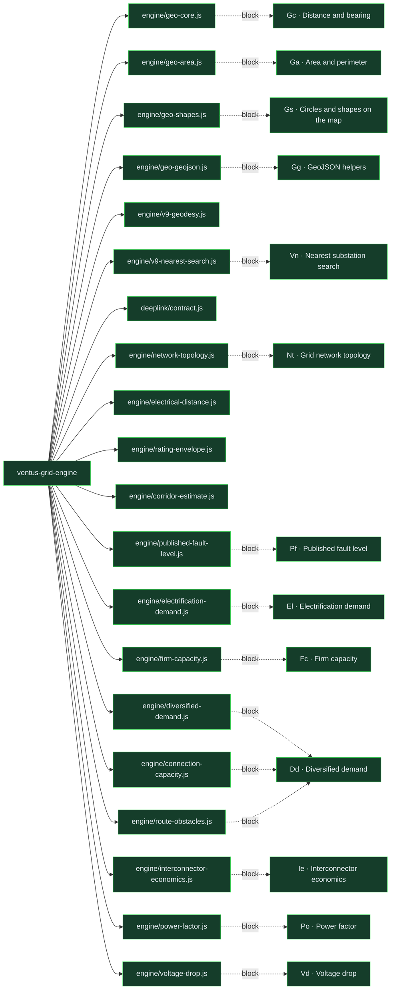

# Structure of globalgrid2050 architecture development

Updated 2026-09-25 12:10 UTC by GitHub Actions. Top-down: globalgrid2050 architecture development, its repositories, the categories of the periodic table, the named blocks with their interdependencies, and the canonical modules of the engine in the engine graph's own order.
The same structure, card by card, is `structure/graph.json` (105 KB, 131 cards, 376 links), registered for the Spider dashboard as **Structure of globalgrid2050 architecture development**. Amber is a block whose value is not yet settled; grey has no function inside yet.

## Repositories (36)

## Blocks by category (63), arrows mean "depends on"

```mermaid
flowchart LR
  classDef ok fill:#153d2a,stroke:#39d353,color:#e6edf3
  classDef warn fill:#3d2f0f,stroke:#ffd54a,color:#e6edf3
  classDef fail fill:#3d1414,stroke:#ff6b6b,color:#e6edf3
  classDef live fill:#12304a,stroke:#58a6ff,color:#e6edf3
  classDef off fill:#21262d,stroke:#6b7280,color:#9aa3b5
  subgraph n_constants["Constants and vocabularies"]
    n_block_At["At · Allowed technologies"]:::warn
    n_block_Ek["Ek · Earth km"]:::warn
    n_block_Hr["Hr · Hit radius edge px"]:::warn
    n_block_Hi["Hi · Hit radius vertex px"]:::warn
    n_block_L["L · Limit"]:::warn
    n_block_Mr["Mr · Max resources"]:::warn
    n_block_Mt["Mt · Max tries"]:::warn
    n_block_Ri["Ri · Repd ids"]:::warn
    n_block_Rp["Rp · Repd page"]:::warn
    n_block_Sm["Sm · Solar min exclusive"]:::warn
    n_block_S["S · Statuses"]:::warn
    n_block_T["T · Technologies"]:::warn
  end
  subgraph n_geodesy["Geodesy and distance"]
    n_block_Gc["Gc · Distance and bearing"]:::ok
    n_block_Ga["Ga · Area and perimeter"]:::ok
    n_block_Gs["Gs · Circles and shapes on the map"]:::ok
    n_block_Gg["Gg · GeoJSON helpers"]:::ok
    n_block_Vg["Vg · Geodesy (v9 atlas copy)"]:::off
    n_block_Vn["Vn · Nearest substation search"]:::ok
  end
  subgraph n_network["Grid network and electrical"]
    n_block_Nt["Nt · Grid network topology"]:::ok
    n_block_Ed["Ed · Electrical distance"]:::off
    n_block_Re["Re · Line and transformer ratings"]:::off
    n_block_Pf["Pf · Published fault level"]:::ok
    n_block_Po["Po · Power factor"]:::ok
    n_block_Vd["Vd · Voltage drop"]:::ok
  end
  subgraph n_connections["Connections and capacity"]
    n_block_Ce["Ce · Cable corridor estimate"]:::off
    n_block_El["El · Electrification demand"]:::ok
    n_block_Fc["Fc · Firm capacity"]:::ok
    n_block_Dd["Dd · Diversified demand"]:::ok
    n_block_Cc["Cc · Connection capacity"]:::ok
    n_block_Ro["Ro · Route obstacles"]:::ok
    n_block_Ie["Ie · Interconnector economics"]:::ok
  end
  subgraph n_cartridges["Map cartridges"]
    n_block_Sp["Sp · streaming-parquet-bridge"]:::ok
    n_block_Ug["Ug · uk-gazetteer-flyto"]:::ok
    n_block_Ss["Ss · sld-sandbox"]:::ok
    n_block_Si["Si · substation-intelligence"]:::ok
    n_block_Ra["Ra · REPD Grid Atlas core engine (v3 to v8)"]:::ok
  end
  subgraph n_layers["Map layers"]
    n_block_A["A · Airports"]:::ok
    n_block_D["D · Datacentres"]:::ok
    n_block_G1["G1 · Grid 132 kV"]:::off
    n_block_G2["G2 · Grid 220 kV"]:::off
    n_block_Gr["Gr · Grid 275 kV"]:::off
    n_block_G4["G4 · Grid 400 kV"]:::off
    n_block_G6["G6 · Grid 66 kV"]:::off
    n_block_Gri["Gri · Grid substations"]:::off
    n_block_Io["Io · Industrial offtakers"]:::ok
    n_block_Pp["Pp · Power plants"]:::ok
    n_block_R["R · Railways"]:::ok
    n_block_Sa["Sa · Satellite imagery"]:::ok
    n_block_Dc["Dc · Data centres and offtakers data tools"]:::ok
  end
  subgraph n_arrival["Deep links and arrival"]
    n_block_Dt["Dt · The MAP button (deep-link contract)"]:::ok
    n_block_Ps["Ps · Place search and arrival"]:::ok
  end
  subgraph n_news["Pipeline News"]
    n_block_Pn["Pn · Pipeline News app"]:::ok
    n_block_Gp["Gp · Grid proximity panel"]:::ok
    n_block_Wf["Wf · Wider fleet panel"]:::ok
    n_block_Ln["Ln · Live news discovery"]:::ok
  end
  subgraph n_solar["Solar, BESS and cables"]
    n_block_Cg["Cg · Cable trench geometry"]:::ok
    n_block_Sb["Sb · Solar and BESS single-line sandbox"]:::ok
    n_block_St["St · Solar electrical topology (text engine)"]:::ok
  end
  subgraph n_interface["Pages and interface"]
    n_block_Tp["Tp · Teleprinter controls"]:::ok
    n_block_Em["Em · Site menu bar"]:::ok
    n_block_Mb["Mb · Atlas menu bar"]:::off
  end
  subgraph n_proofs["Proofs and checks"]
    n_block_Pr["Pr · Proofs and checks"]:::ok
    n_block_Gn["Gn · Genome and spiders"]:::ok
  end
  n_block_Sp --> n_block_Pr
  n_block_Sp --> n_block_Cg
  n_block_Ug --> n_block_St
  n_block_Ug --> n_block_Tp
  n_block_Ug --> n_block_Pr
  n_block_Ug --> n_block_Gn
  n_block_Ss --> n_block_Pr
  n_block_Ss --> n_block_St
  n_block_Ss --> n_block_Tp
  n_block_Ss --> n_block_Gn
  n_block_Si --> n_block_Pr
  n_block_Si --> n_block_St
  n_block_Si --> n_block_Tp
  n_block_Si --> n_block_Gn
  n_block_Si --> n_block_Sa
  n_block_Ra --> n_block_St
  n_block_Ra --> n_block_Tp
  n_block_Ra --> n_block_Pr
  n_block_Ra --> n_block_Gn
  n_block_Ra --> n_block_Ss
  n_block_Ra --> n_block_Si
  n_block_Ra --> n_block_Wf
  n_block_Sa --> n_block_St
  n_block_Sa --> n_block_Tp
  n_block_Sa --> n_block_Pr
  n_block_Sa --> n_block_Gn
  n_block_Sa --> n_block_Ie
  n_block_Sa --> n_block_Ss
  n_block_Dt --> n_block_Ps
  n_block_Dt --> n_block_Pr
  n_block_Dt --> n_block_Gp
  n_block_Dt --> n_block_St
  n_block_Dt --> n_block_Tp
  n_block_Dt --> n_block_Gn
  n_block_Dt --> n_block_Cg
  n_block_Dt --> n_block_Dc
  n_block_Ps --> n_block_Ss
  n_block_Ps --> n_block_Si
  n_block_Ps --> n_block_Wf
  n_block_Pn --> n_block_Pr
  n_block_Pn --> n_block_Si
  n_block_Pn --> n_block_Tp
  n_block_Pn --> n_block_St
  n_block_Pn --> n_block_Gn
  n_block_Pn --> n_block_Ss
  n_block_Pn --> n_block_Wf
  n_block_Pn --> n_block_Dt
  n_block_Pn --> n_block_Sa
  n_block_Gp --> n_block_Ss
  n_block_Gp --> n_block_Si
  n_block_Gp --> n_block_Wf
  n_block_Wf --> n_block_St
  n_block_Wf --> n_block_Tp
  n_block_Wf --> n_block_Pr
  n_block_Wf --> n_block_Gn
  n_block_Wf --> n_block_Pn
  n_block_Ln --> n_block_Pr
  n_block_Ln --> n_block_St
  n_block_Ln --> n_block_Tp
  n_block_Ln --> n_block_Gn
  n_block_Cg --> n_block_Pr
  n_block_Cg --> n_block_Si
  n_block_Cg --> n_block_Ra
  n_block_Cg --> n_block_Pn
  n_block_Cg --> n_block_Gn
  n_block_Cg --> n_block_Ss
  n_block_Cg --> n_block_Dt
  n_block_Cg --> n_block_Wf
  n_block_Cg --> n_block_Dc
  n_block_Cg --> n_block_St
  n_block_Cg --> n_block_Ps
  n_block_Cg --> n_block_Sb
  n_block_Cg --> n_block_Gp
  n_block_Cg --> n_block_Tp
  n_block_Cg --> n_block_Sa
  n_block_Sb --> n_block_St
  n_block_Sb --> n_block_Tp
  n_block_Sb --> n_block_Pr
  n_block_Sb --> n_block_Gn
  n_block_Sb --> n_block_Ss
  n_block_Sb --> n_block_Si
  n_block_Sb --> n_block_Wf
  n_block_Sb --> n_block_Cg
  n_block_Sb --> n_block_Pn
  n_block_St --> n_block_Si
  n_block_St --> n_block_Tp
  n_block_St --> n_block_Sp
  n_block_St --> n_block_Dt
  n_block_St --> n_block_Pn
  n_block_St --> n_block_Em
  n_block_St --> n_block_Gn
  n_block_Tp --> n_block_Pr
  n_block_Tp --> n_block_Ss
  n_block_Tp --> n_block_Gn
  n_block_Tp --> n_block_Si
  n_block_Tp --> n_block_Wf
  n_block_Tp --> n_block_Pn
  n_block_Em --> n_block_St
  n_block_Em --> n_block_Tp
  n_block_Em --> n_block_Pr
  n_block_Em --> n_block_Gn
  n_block_Pr --> n_block_Dc
  n_block_Pr --> n_block_Dt
  n_block_Gn --> n_block_Dt
  n_block_Gn --> n_block_St
  n_block_Gn --> n_block_Pn
  n_block_Gn --> n_block_Em
```

## Engine modules (20), in the engine graph's order

